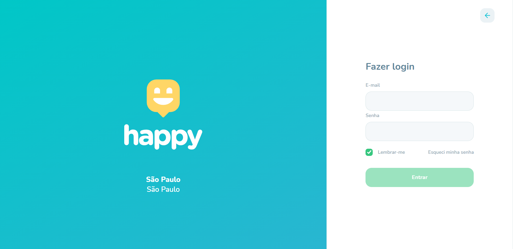
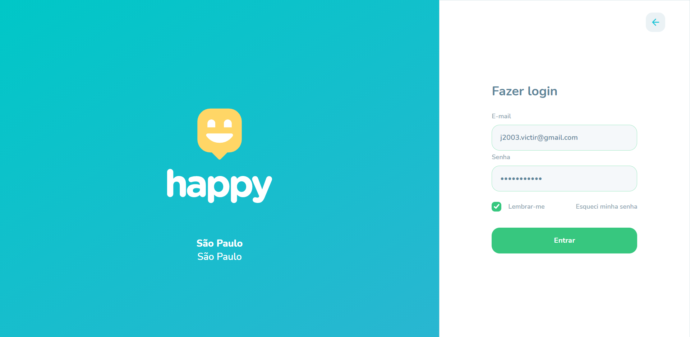
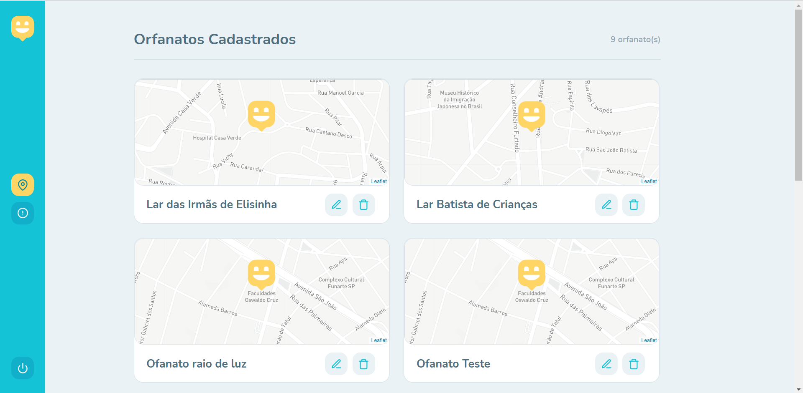
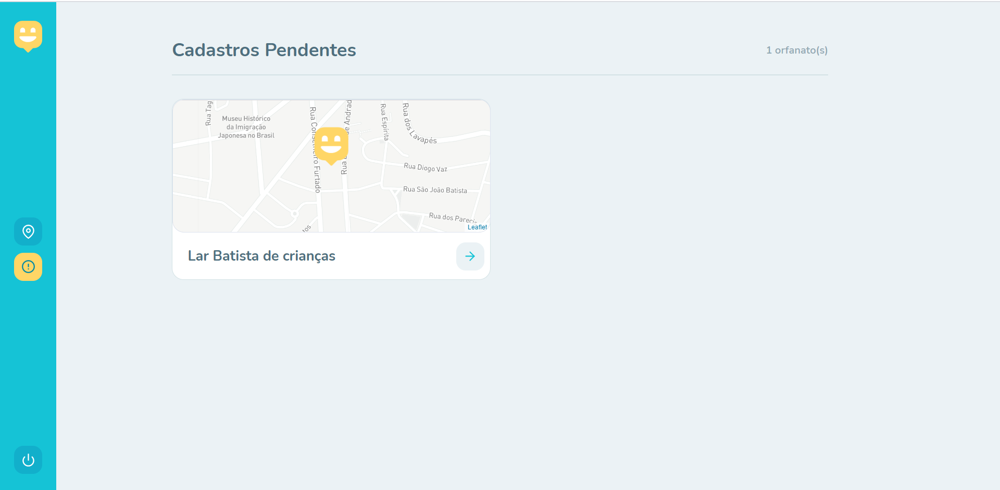

## 🚀 Tecnologias

Esse projeto foi desenvolvido com as seguintes tecnologias:

- [Node.js](https://nodejs.org/en/)
- [React](https://reactjs.org)
- [React Native](https://facebook.github.io/react-native/)
- [Expo](https://expo.io/)
- [TypeScript](https://www.typescriptlang.org/)

## 💻 Projeto

O Happy é uma aplicação que conecta pessoas à casas de acolhimento institucional para fazer o dia de muitas crianças mais feliz 💜. Feito durante o evento Next Level Week, projeto original: https://github.com/rocketseat-education/nlw-03-omnistack

## 🔖 Layout

Nos links abaixo você encontra o layout do projeto web e também do mobile. Lembrando que você precisa ter uma conta no [Figma](http://figma.com/) para acessá-lo.

- [Layout Web](https://www.figma.com/file/mDEbnoojksG4w8sOxmudh3/Happy-Web)
- [Layout Mobile](https://www.figma.com/file/X27FfVxAgy9f5IFa7ONlph/Happy-Mobile)

## 📁 Scripts

Para rodar o servidor utilize o comando:
- yarn dev

Para rodar a aplicação web utilize:
- yarn start

## 📚  Desafio 2.0

Aqui está uma parte dos desafios feitos,

- Página de login e autenticação
- Página de Dashboard
- Listagem de orfanatos cadastrados
- Listagem de orfanatos pendentes

 
<h2> Login </h2>
  

  
  
 

 
<h2> Dashboard </h2>
  

  
  
 

Logo mais os desafios completos!